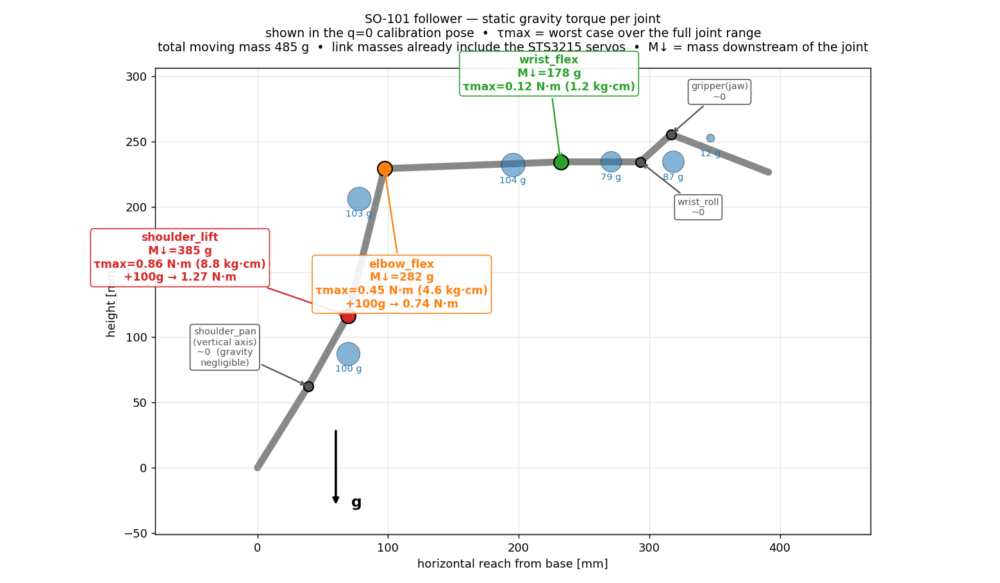

# SO-101 Spring Gravity-Compensation — Design Notes

Prototyping a **spring-based gravity-assist** for the SO-101 follower arm. The
goal is *not* a true counterweight (which would add mass), but a spring that
cancels most of the **static** gravity torque at the gravity-loaded joints, so
the servos run cooler, sag less, and drift less when holding a pose.

All numbers below come straight from the arm's own model
(`../Simulation/SO101/so101_new_calib.urdf`) — no weighing required, because the
URDF link masses **already include the STS3215 servos**.

---

## TL;DR

- **shoulder_lift is the problem child:** worst-case static gravity torque
  **≈ 0.86 N·m (8.8 kg·cm)**, bare gripper. Elbow is half that; wrist is minor.
- That's ~30% of the servo's ~30 kg·cm stall — the arm *can* lift it, but
  *holding* there is what causes heat / sag. A spring fixes exactly that.
- **Plan:** assist `shoulder_lift` first, bare gripper, with an adjustable
  spring (multiple anchor holes) tuned to **50–70 % compensation**.
- **Buy:** extension springs in the **~15–30 N (1.5–3 kgf)** window. See
  [Shopping list](#shopping-list).

---

## 1. The arm's mass model (from the URDF)

The STS3215 servo that is physically part of each link is **bundled into that
link's mass** in the URDF, so these are motor-inclusive:

| Link | Mass (kg) | Contents |
|---|---|---|
| base_link | 0.147 | base + motor1 (shoulder_pan) — *fixed, irrelevant to gravity* |
| shoulder_link | 0.100 | motor2 (shoulder_lift) + holder + rotation pitch |
| upper_arm_link | 0.103 | motor3 (elbow_flex) + upper arm |
| lower_arm_link | 0.104 | motor4 (wrist_flex) + under-arm + wrist holder |
| wrist_link | 0.079 | motor5 (wrist_roll) + wrist pitch |
| gripper_link | 0.087 | motor6 (gripper) + wrist roll follower |
| moving_jaw | 0.012 | moving jaw (pure plastic) |

**Total moving mass ≈ 0.485 kg.**

### Cross-check against measured print weight
A BambuLab print-history total of **228 g of plastic** (45 g for the two gripper
sides + 183 g for the rest) confirms the model:

- URDF total = 632 g, including all 6 servos.
- 632 g − 228 g plastic = ~404 g for 6 motors + hardware → **~60 g per STS3215**,
  exactly the published spec. ✔
- The URDF moving-jaw link is 12 g of pure plastic, matching one printed jaw
  side. ✔

So the masses used for the torque calculation are trustworthy.

---

## 2. Per-joint static gravity torque



Worst-case static gravity torque over the **full joint range** (computed by
`gravity_spring_analysis.py`):

| Joint | Mass below it | Worst case (bare gripper) | + 100 g payload |
|---|---|---|---|
| **shoulder_lift** | 385 g | **0.86 N·m (8.8 kg·cm)** | 1.27 N·m |
| **elbow_flex** | 282 g | **0.45 N·m (4.6 kg·cm)** | 0.74 N·m |
| **wrist_flex** | 178 g | 0.12 N·m (1.2 kg·cm) | 0.22 N·m |
| shoulder_pan, wrist_roll, gripper | — | ≈ 0 (axes near-vertical / along arm) | — |

Gut-check: `0.385 kg × 9.81 × ~0.23 m ≈ 0.87 N·m` for the shoulder. ✔

**Why it matters vs. the servo:** the 1:345 follower STS3215 stalls around
~30 kg·cm (~2.9 N·m). Worst-case shoulder gravity is only ~30% of *stall*, so
the arm lifts fine — but *holding* statically at 30% of stall draws heavy
current → heat, sag, position drift. Cancelling that static load is the whole
point of the spring.

---

## 3. The equations

### 3.1 What you're cancelling (gravity)
For one flex joint with downstream mass `M` and COM at perpendicular distance
`d` from the axis, with `θ` measured from straight-down:

```
τ_g(θ) = M · g · d · sin(θ)          max at horizontal:  τ_g,max = M·g·d
```

(The script sums every link exactly; for sizing, the single equivalent `(M, d)`
above is enough.)

### 3.2 What a spring gives
Spring from fixed anchor `A` to a point `B` on the moving link:

```
F_s = k·(L − L₀),   L = |A − B|
τ_s = F_s · r⊥       (r⊥ = perpendicular distance from joint axis to line A–B)
```

### 3.3 Full-range cancellation — the zero-free-length trick
If the spring behaves as **zero-free-length** (`L₀ = 0` — a true ZFL spring, or
a normal spring + cable/pulley so preload eats the free length), anchored at
distance `a` on the fixed frame above the pivot and `b` on the link:

```
τ_s(θ) = k·a·b·sin(θ)        ← same sin shape as gravity!
```

So gravity is cancelled **at every angle** when:

```
┌─────────────────────────┐
│   k · a · b = M · g · d  │   ← master design equation
└─────────────────────────┘
```

### 3.4 Practical first prototype (adjustable holes)
Cheap extension springs aren't ZFL, so you match gravity near the worst-case
zone instead of perfectly everywhere. Pick a compensation fraction `c`
(start **0.5–0.7**; don't over-compensate or the arm fights the spring):

```
τ_target = c · τ_g,max
F_peak   = τ_target / b              (b = chosen hole distance from the axis)
```

For shoulder_lift (`τ_g,max = 0.86 N·m`, bare gripper):

| Lever arm `b` | `F_peak` needed |
|---|---|
| 20 mm | 22–30 N (2.2–3.0 kgf) |
| 25 mm | 17–24 N (1.7–2.4 kgf) |
| 30 mm | 14–20 N (1.5–2.0 kgf) |

Because the anchor-to-anchor distance changes by up to ~40–50 mm as the
shoulder swings ±100°, target a spring rate around **k ≈ 0.5–2 N/mm** with
enough travel.

---

## 4. Decisions for v1

- **Joint:** `shoulder_lift` first (largest load, main heat/sag source).
- **Payload:** none / bare gripper.
- **Compensation:** 50–70 %.
- **Mechanism:** 3D-printed bracket with anchor holes at `b = 15/20/25/30 mm`,
  extension spring from an assortment, tune empirically.

---

## 5. Shopping list

1. **Extension spring assortment (with hooks)** — one mixed kit, ~€8–16.
   - Search: `extension spring assortment with hooks` /
     FR: `assortiment ressorts de traction avec crochets`
   - Want springs roughly OD 5–10 mm, wire 0.8–1.2 mm, free length 25–60 mm.
2. **2–3 targeted springs** — free length 35–50 mm, k ≈ 1 N/mm, hooks both
   ends, able to stretch to ~2× without yielding. Likely your final shoulder
   springs.
3. **Anchoring hardware:**
   - M3 **heat-set threaded inserts** (brass, for PLA/PETG) — essential.
   - M3 screws (6–16 mm) + small washers.
   - M3 **screw-eyes / eye bolts / eyelets** as spring hook points
     (FR: `vis à œillet M3`).
4. **Digital hanging scale (0–5 kg)**, ~€6 — *strongly recommended*:
   - Measure each spring's real force-vs-stretch (`k`) in minutes.
   - Measure actual joint torque: pull at known radius `r` until the joint just
     lifts → `τ = F_scale × r`. Validates the 0.86 N·m on the physical arm.
   - Search: `digital luggage scale 5kg` / FR: `peson digital balance bagage`.
5. *Optional (for the ZFL cable trick later):* small pulleys / smooth M3
   standoffs + thin braided line (~20 kg). Skip for v1.

---

## 6. Bring-up & validation

1. Print/improvise a shoulder bracket with anchor holes at `b = 15–30 mm`.
2. Hang the scale on a spring, stretch it, record force at a few lengths → `k`.
3. Pick a spring + hole so peak force ≈ 20 N near the worst-case (arm
   horizontal) pose.
4. **Torque off**, move by hand: should feel near-weightless in the assist
   zone, no violent snap.
5. **Torque on**, run a slow trajectory; log the STS3215's reported present
   load / current before vs. after.

**Success =** lower holding current, less sag/heat, no oscillation, no hard
snap-back.

---

## 7. Files in this folder

| File | What it is |
|---|---|
| `gravity_spring_analysis.py` | Forward kinematics + per-joint static gravity torque vs. configuration. Set `PAYLOAD_KG` to add a gripper load; run to print torque sweeps. |
| `gravity_torque_diagram.py` | Renders `gravity_torque_diagram.png` (the labeled side view). |
| `gravity_torque_diagram.png` | The diagram above. |

Run from inside this folder:

```bash
python gravity_spring_analysis.py     # torque tables
python gravity_torque_diagram.py      # regenerate the diagram
```

Requires Python 3 + `numpy` (and `matplotlib` for the diagram).

---

## 8. Next step

When the springs arrive and you can provide **two physical attach points on the
shoulder + a side photo**, the model can output exact anchor coordinates, a
specific `k` / free-length, and a printable adjustable bracket — then move on to
`elbow_flex`.
