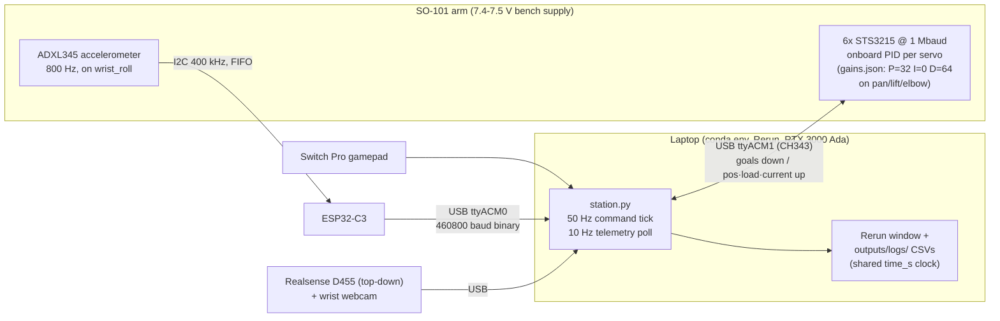
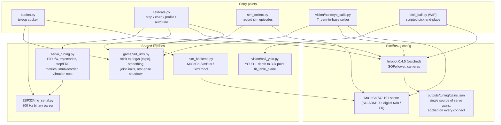

# robot_bazoo

My working setup for an [SO-101](https://github.com/TheRobotStudio/SO-ARM100) follower arm,
built on top of [LeRobot](https://github.com/huggingface/lerobot). A single "station" cockpit
(gamepad teleop + motor/IMU/camera telemetry in one Rerun window), a MuJoCo digital twin, sim
data collection, and a controller-tuning toolkit for the Feetech STS3215 servos.

## Hardware

- SO-101 follower, 6× Feetech STS3215 @ 1 Mbaud — `/dev/ttyACM1` (the ESP32-C3 IMU
  grabs `/dev/ttyACM0`; scripts pick each by USB vendor id, so order doesn't matter)
- Needs 7.4–7.5 V supply (5 V trips under-voltage protection)
- Wrist IMU: ADXL345 on an ESP32-C3, mounted on `wrist_roll`, 800 Hz (see [ESP32/](ESP32/))
- Optional: Realsense D455 + wrist webcam, a Switch Pro controller

## Architecture

### Hardware / control stack

The PID loops run **onboard each servo** (the laptop is never inside them) — host scripts
stream goal positions and read telemetry. Gains are not trusted to EEPROM: the patched
lerobot `configure()` re-applies `outputs/tuning/gains.json` on every connect.



### Software stack

One shared layer per concern — one IMU parser, one gamepad layer, one gains source,
one tuning library — imported by thin entry-point CLIs:



## Setup

```bash
conda activate lerobot                 # Python 3.10, lerobot 0.4.5 editable install
git -C lerobot apply ../patches/lerobot_local.patch   # P-gain + camera fixes (see below)
```

`lerobot/` and `SO-ARM100/` are external repos and aren't tracked here — clone them yourself.
The patch makes `configure()` apply per-motor gains from `outputs/tuning/gains.json` on every
connect (default P=32 so the arm holds against gravity) and makes camera connect/read
fault-tolerant.

## Documentation map

Everything written down in this repo, from here:

| Doc | What's in it |
|---|---|
| [CLAUDE.md](CLAUDE.md) | The deep reference: hardware gotchas, conventions, env pins, full status & history |
| [vision/PERCEPTION3D.md](vision/PERCEPTION3D.md) | **3-D perception stack**: design + principles, sphere-fit localization, benchmark results, how to add new objects, roadmap (world-anchor tag, plane persistence, 3-D proposals) |
| [vision/HANDEYE.md](vision/HANDEYE.md) | **Hand-eye calibration**: the math (joint 9-unknown solve), why a sticker marker works, how to re-run, how to consume `handeye.json` |
| [vision/DETECTOR.md](vision/DETECTOR.md) | **Detector pipeline**: GDINO teacher → yolov8n student, auto-labeling, benchmark protocol, negative results |
| [ESP32/CLAUDE.md](ESP32/CLAUDE.md) | Wrist-IMU firmware + host readers |

## Scripts

| Script | What it does |
|---|---|
| `station.py` | **Main entry point.** Gamepad teleop + typed commands while motors, the wrist IMU, the controller, and (opt) cameras stream to one Rerun window + CSV. Flags: `--observe` (read-only), `--health`, `--cameras`, `--twin`, `--no-imu`, `--no-log`. |
| `pick_ball.py` | Scripted ball pick (WIP): student-YOLO detection → sphere-fit 3-D → IK → staged grasp; `--dry-run`, `--watch`, `--selftest`, MuJoCo twin preview |
| `gamepad_utils.py` | Shared controller profiles, smoothing, graceful shutdown |
| `sim_collect.py` | Collect episodes in MuJoCo as a LeRobot dataset |
| `servo_tuning.py` | Tuning toolbox: PID r/w, trajectories, step/FRF analysis |
| `calibrate.py` | `step` / `chirp` / `profile` / `autotune` CLI for the servos |
| `vision/scene_debug.py` | **The 3-D truth window**: camera panel + point cloud + MuJoCo twin; live measured-vs-predicted marker error |
| `vision/handeye_calib.py` | Hand-eye calibration tool (gamepad + capture + solver) |
| `vision/autolabel.py`, `vision/detector_bench.py`, `vision/bench_localize.py` | Detector auto-labeling / detector benchmark / 3-D localization benchmark |
| `vision/collect_marker_data.py` | Bounded autonomous arm session for marker training data |
| `ESP32/` | ESP32-C3 + ADXL345 IMU firmware and host-side readers |

```bash
python station.py                  # full cockpit: teleop + motors + IMU → Rerun + CSV
python station.py --observe        # read-only telemetry (safe, no motion)
python calibrate.py autotune --joint shoulder_pan --size 25 --trials 40
```

Each `station.py` run writes `outputs/logs/<timestamp>/` with `station.csv` (motors),
`imu.csv` (IMU @ 800 Hz), and `summary.txt`. Both CSVs share one `time_s` clock, so they
merge directly for motor↔IMU analysis.

Detailed hardware notes, register quirks, and status live in [CLAUDE.md](CLAUDE.md).

## TODO

Live worklist; longer status/history lives in [CLAUDE.md](CLAUDE.md).

**Primary: end-to-end VLA** (main direction — see CLAUDE.md)
- [x] Realsense capture tool (`vision/capture_frame.py`) + RANSAC table-plane fit.
- [x] **Ball detection via YOLO** (`vision/ball_yolo.py`): pretrained basketball
      `best.pt` (`vision/models/basketball.pt`) → 2-D box → back-project box centre
      through depth → 3-D point (cam frame); keeps `fit_table_plane`. Clean single
      box @0.36 conf where color was brittle (wood reads orange). Zero-shot COCO
      (`orange`@0.09) and YOLO-World (@0.18) were too weak. Fine-tune on our scene
      later if conf wobbles at table edges / under occlusion (model = ready auto-labeler).
- [x] **Hand-eye calibration done** (`vision/handeye_calib.py`): **4.6 mm RMS over
      16 poses** → `outputs/calib/handeye.json`. Marker = the **pink heart sticker** on a
      gripper finger, detected with **Grounding DINO** ("heart" zero-shot) + an in-box
      pink gate (hue wraps: gate both HSV ends, cap saturation to reject the red arm).
      Per pose: pink pixel + depth → 3-D (cam frame), joint angles + MuJoCo FK →
      3-D (base frame); least-squares jointly fits T_cam→base **and** the marker offset.
      How/why: [vision/HANDEYE.md](vision/HANDEYE.md).
- [~] **Scripted pick — FIRST VERIFIED GRASP 2026-06-12 night** (`pick_ball.py`):
      gripper stalled on the ball → lifted → surface empty → placed back. What it
      took (all measured, see commit 8a3e7a7): the wrist_roll −84.6° mapping delta
      applied at one deg→qpos boundary (FK/IK + every viewer), a **+32 mm z bias**
      (physical fingertips higher than the model TCP — plate-touch probe), an
      **x bias** from live sweep-contact sensing, and the **jaw close-axis rotated
      90°** (the single-actuated jaw was batting the foam ball away). Capture margin
      is ±8 mm and the FK bias drifts across the plate → reliability needs the
      arm-kinematics ID (below).
- [~] **Fast scene detector** — GDINO-as-teacher auto-labeling (`vision/autolabel.py`)
      → yolov8n student + benchmark (`vision/detector_bench.py`). v1 trained on 45
      auto-labeled frames; see [vision/DETECTOR.md](vision/DETECTOR.md).
- [ ] Scripted pick→rotate→place state machine, with randomization.

**Open bugs / measurements pending (2026-06-12)**
- [x] ~~wrist_roll mapping offset~~ — measured −84.6° (jaw-sweep, gauge-broken) and
      now applied at one shared deg→qpos boundary in FK/IK/Twin/scene_debug. A/B
      renders from the calibrated camera match the real gripper.
- [ ] **Arm kinematics ID** (the big remaining accuracy item): FK position bias is
      pose-dependent (measured: +32 mm z everywhere probed, ~+21 mm x at one spot,
      drifting across the plate; tag data showed roll-structured residuals no
      constant delta explains). Fix = full joint-offset/scale + finger-geometry fit
      from a varied-pose ArUco dataset; until then `corner_fkerr.json` feeds local
      measured biases forward and the pursuit loop closes the rest.
- [ ] **ArUco tags**: printed + glued to the fingers, but the builds are missing the
      **black border ring** (only white patch + inner cells) → undecodable: tried
      OpenCV parameter storm (border bits, polarity, mirror), custom frame-fraction
      template matching, a bright-quad detector, and **DeepArUco++** (pretrained, in an
      isolated venv: fires on 2/5 poses at conf ≤0.09, decodes at hamming 9/16 ≈
      chance). Same-batch tag2 (which HAS the ring) decodes at 22 px → **fix is
      physical: sharpie a ~5 mm black square ring around the glued cells** (or
      temporarily borrow tag2 for the sweep). `vision/tag_sweep.py` is ready and waits.
- [ ] cm-level "fingertip mesh below table" in the twin — quantify after the tag
      sweep (mesh-vs-site vs real FK error not yet separable).
- [x] ~~Consumers still fit a single table plane~~ — done: `cloud.extract_planes`
      wired into `pick_ball` + `scene_debug`; support surfaces + ball attribution in
      `vision/scene_model.py` (`scene_model.json` contract, v0).
- [ ] Cosmetic: GLX errors when the MuJoCo twin window closes after a pick run.
- [ ] Auto-record LeRobot dataset in a loop → train **ACT**, then **SmolVLA**.
- [ ] Fix two-camera USB stall (wrist cam for grasp) or collect top-down-only first.

**Done 2026-06-11 — servo tuning + teleop (see CLAUDE.md for details)**
- [x] **IMU integrated into `calibrate.py`** — every hardware capture records the wrist
      IMU; `step`/`profile` report after-stop decay/residual/ring-frequency, `autotune`
      penalizes measured wrist ringing in its cost. Verified on hardware.
- [x] **Tuned the big joints** — after-stop oscillation was an underdamped loop
      (factory D=32): now **P=32 I=0 D=64** on pan/lift/elbow via `gains.json`
      (applied at every connect). I>0 limit-cycles against stiction — keep I=0.
      Irreducible ~0.5 m/s² holding buzz at gravity poses = torque dither, not PID.
- [x] **Teleop overhaul** — 50 Hz command tick decoupled from telemetry polling,
      `JOINT_SPEED` in deg/s (~2.5× faster), expo stick curve.

**Next (at the bench, arm at 7.5 V)**
- [ ] Commanded **chirp on elbow_flex** (`calibrate.py` + `station.py` logging) → confirm
      the **~9.6 Hz** structural mode found in teleop (hand-wiggle, not clean yet).
- [ ] **Wrist pose-sweep** (wave wrist_roll + wrist_flex through full range, rest still) →
      pin the IMU mounting rotation below ~1° (currently 2.9°, see `analyze_run.py`).
- [ ] Use IMU→link rotation to subtract gravity + rigid-body accel → pure joint oscillation.

**Fixes / cleanup**
- [ ] `graceful_shutdown` Ctrl-C move was abrupt/noisy — slower easing / tune REST_POSE.
- [ ] Handle the ±100% `load_pct` single-sample spikes (direction-reversal glitch) when
      parsing motor loads for calibration.
- [ ] Realsense + wrist cam USB bandwidth (works alone, stalls together).

**Findings (2026-06-10, run 00-48-25)**
- Wrist vibration ~9.6 Hz (mode) + 19.3 Hz (harmonic); RMS 0.5 m/s², peak 8.
- Vibration tracks joint **speed** (r=0.60), not current — mostly **elbow** (0.59), then pan/lift.
- IMU mounting solved: IMU +X≈link+Z, +Y≈link+X, +Z≈link+Y (residual 2.9°).
