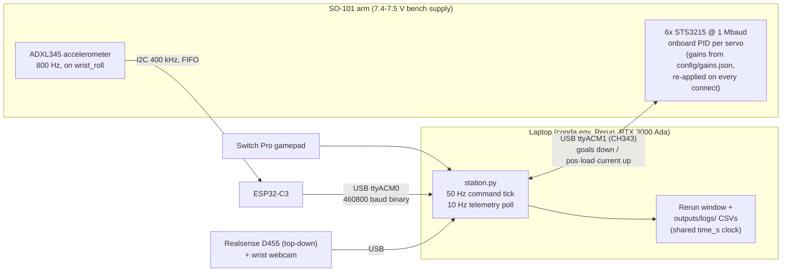
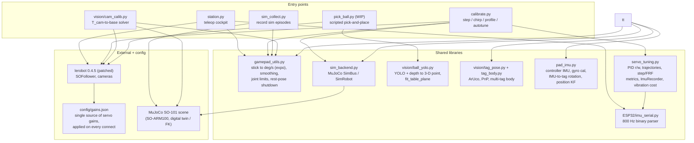

# robot_bazoo

My working setup for an [SO-101](https://github.com/TheRobotStudio/SO-ARM100) follower arm,
built on top of [LeRobot](https://github.com/huggingface/lerobot). A single "station" cockpit
(gamepad teleop + motor/IMU/camera telemetry in one Rerun window), a MuJoCo digital twin, sim
data collection, and a controller-tuning toolkit for the Feetech STS3215 servos.

## Start here

Nothing below needs the arm powered until step 3. Each step works on its own.

**1. Is the joystick alive?** No robot, no camera, no MuJoCo.

```bash
conda activate lerobot
python gamepad_utils.py
```

**2. Watch the arm without moving it.** Motors, wrist IMU and gamepad stream into one
Rerun window. Read-only — the arm cannot move.

```bash
python station.py --observe
```

**3. Drive the arm with the gamepad.** L-stick = pan/lift, R-stick = elbow/wrist-roll,
L/R = wrist-flex, ZL/ZR = gripper. Needs **7.4–7.5 V** (see Hardware).

```bash
python station.py
```

**4. Drive the arm by moving your hand.** A webcam watches a tag-marked box held in your
hand. Try it against the MuJoCo twin first — no real arm involved:

```bash
python teleop_tag.py --sim
```

No webcam and no box? A rendered one works for everything except the feel:

```bash
python teleop_tag.py --sim --source virtual
```

**5. Check the maths without any hardware.** Every layer can prove itself offline:

```bash
python teleop_tag.py --selftest      # tag+IMU fusion against a known hand path
python pad_imu.py selftest           # IMU/camera alignment solver
python vision/tag_body.py --selftest # multi-tag body model
python vision/tag_pose.py --selftest # detector + PnP
python calibrate.py --sim autotune --joint shoulder_pan --size 25 --trials 40
```

## Hardware

- SO-101 follower, 6× Feetech STS3215 @ 1 Mbaud — `/dev/ttyACM1` (the ESP32-C3 IMU
  grabs `/dev/ttyACM0`; scripts pick each by USB vendor id, so order doesn't matter)
- Needs 7.4–7.5 V supply (5 V trips under-voltage protection)
- Wrist IMU: ADXL345 on an ESP32-C3, mounted on `wrist_roll`, 800 Hz (see [ESP32/](ESP32/))
- Optional: Realsense D455 + wrist webcam, a Switch Pro controller

## Architecture

### Hardware / control stack

The PID loops run **onboard each servo** (the laptop is never inside them) — host scripts
stream goal positions and read telemetry. Gains are not trusted to EEPROM: the patched
lerobot `configure()` re-applies `config/gains.json` on every connect.



### Software stack

One shared layer per concern — one IMU parser, one gamepad layer, one gains source,
one tuning library — imported by thin entry-point CLIs:



## Setup

```bash
conda activate lerobot                 # Python 3.10, lerobot 0.4.5 editable install
git -C lerobot apply ../patches/lerobot_local.patch   # P-gain + camera fixes (see below)
```

`lerobot/` and `SO-ARM100/` are external repos and aren't tracked here — clone them yourself.
The patch makes `configure()` apply per-motor gains from `config/gains.json` on every
connect (default P=32 so the arm holds against gravity) and makes camera connect/read
fault-tolerant.

## Documentation map

| Doc | What's in it |
|---|---|
| [CLAUDE.md](CLAUDE.md) | The deep reference: hardware gotchas, conventions, env pins, full status & history |
| [TELEOP.md](TELEOP.md) | **Tag teleop**: the clutched-relative mapping, safety rails, tag/IMU fusion, measured timings |
| [vision/PERCEPTION3D.md](vision/PERCEPTION3D.md) | **3-D perception**: sphere-fit localization, benchmarks, how to add new objects |
| [vision/DETECTOR.md](vision/DETECTOR.md) | **Detector pipeline**: GDINO teacher → yolov8n student, auto-labeling, benchmark |
| [vision/HANDEYE.md](vision/HANDEYE.md) | Hand-eye calibration (superseded; kept for the maths) |
| [ESP32/CLAUDE.md](ESP32/CLAUDE.md) | Wrist-IMU firmware + host readers |

## Scripts

**Drive the arm**

| Script | What it does |
|---|---|
| `station.py` | **Main entry point.** Gamepad teleop + typed commands while motors, wrist IMU, controller and (opt) cameras stream to one Rerun window + CSV. `--observe`, `--health`, `--cameras`, `--twin`, `--no-imu`, `--no-log` |
| `teleop_tag.py` | **Tag teleop**: move the arm by moving a tag box in front of a webcam. `--sim`, `--source virtual`, `--gain`, `--max-speed`, `--axes`, `--selftest`. See [TELEOP.md](TELEOP.md) |
| `pick_ball.py` | Scripted ball pick (WIP): detect → sphere-fit 3-D → IK → staged grasp. `--dry-run`, `--watch`, `--selftest` |
| `record_pick.py` | Record real-arm pick demos into a LeRobot dataset |
| `sim_collect.py` | Collect episodes in MuJoCo as a LeRobot dataset |

**The hand-held tag box** (the teleop input device)

| Script | What it does |
|---|---|
| `vision/box_tags.py` | Take the box from unknown to calibrated: `ident` → `capture` → `fit` → `show`. Plus `debug` (Rerun) and `window` (pygame) to watch detection live |
| `pad_imu.py` | The controller's own 6-axis IMU: `gyrocal` (scale+bias vs gravity, no camera), `align` (IMU↔tag rotation), `view` (camera vs gyro, live), `check`, `solo` |
| `vision/tag_pose.py` | Base tag layer: camera sources, ArUco detection, single-tag PnP |
| `vision/tag_body.py` | Rigid multi-tag body model, plus `VirtualCam` (renders a tag body — no hardware) |

**Tuning the servos**

| Script | What it does |
|---|---|
| `calibrate.py` | `step` / `chirp` / `profile` / `autotune` CLI. `--sim` runs the whole loop with no hardware |
| `servo_tuning.py` | The library behind it: PID r/w, trajectories, step/FRF metrics, wrist-IMU vibration cost |
| `analyze_run.py` | Offline analysis of a `station.py` run: vibration spectrum, IMU-frame localization |

**Vision / perception**

| Script | What it does |
|---|---|
| `vision/realsense.py` | The camera layer: top-down D455 (aligned color+depth+K) and `backproject` |
| `vision/cam_calib.py` | **The camera-pose calibration path** (T_cam→base). `recal` after any camera move, then `check` |
| `vision/ball_yolo.py` | The ball localizer: YOLO box → known-radius sphere fit on the box's point cloud |
| `vision/cloud.py` | Generic 3-D: depth→cloud, multi-plane RANSAC, geometric-prior fitters |
| `vision/scene_debug.py` | **The 3-D truth window**: arm + point cloud + detections in one MuJoCo view |
| `vision/scene_align.py` | The alignment proof: headless render of robot + cloud + ball in the base frame |
| `vision/autolabel.py`, `vision/detector_bench.py` | GDINO-teacher auto-labeling and the student-vs-teacher benchmark |
| `gamepad_utils.py` | Shared controller profiles, smoothing, graceful shutdown. Run it directly = joystick debugger |
| `ESP32/` | ESP32-C3 + ADXL345 wrist-IMU firmware and host readers |

Each `station.py` run writes `outputs/logs/<timestamp>/` with `station.csv` (motors),
`imu.csv` (IMU @ 800 Hz) and `summary.txt`. Both CSVs share one `time_s` clock, so they
merge directly for motor↔IMU analysis.

## Where the project is

The goal is an end-to-end vision-language-action policy running on this laptop. The
critical path and the full history live in [CLAUDE.md](CLAUDE.md); the short version:

| Piece | State |
|---|---|
| Gamepad teleop, MuJoCo twin, Rerun cockpit, synced CSV logging | done |
| Servo tuning toolkit + measured fix for after-stop ringing | done |
| Ball detection → 3-D point (YOLO + sphere fit) | done |
| Hand-eye calibration (`cam_calib.py`, reference-anchored) | done |
| Tag box + IMU calibration for hand teleop | done |
| Tag teleop on the real arm | works; being re-tested since the box |
| Scripted pick-and-place with randomization | in progress |
| Auto-record dataset → train ACT, then SmolVLA | next |

**Known inconsistency (2026-08-31):** `config/gains.json` holds **D=64** on
pan/lift/elbow, and always has in tracked history. CLAUDE.md's tuning section reports
**D=200** as the measured fix "now in gains.json" — it is not. Either the tuning result
was never written to the file, or the note overstates it. Needs a bench check before
changing anything: the gains apply on every connect, so editing that file changes how
the arm behaves.
